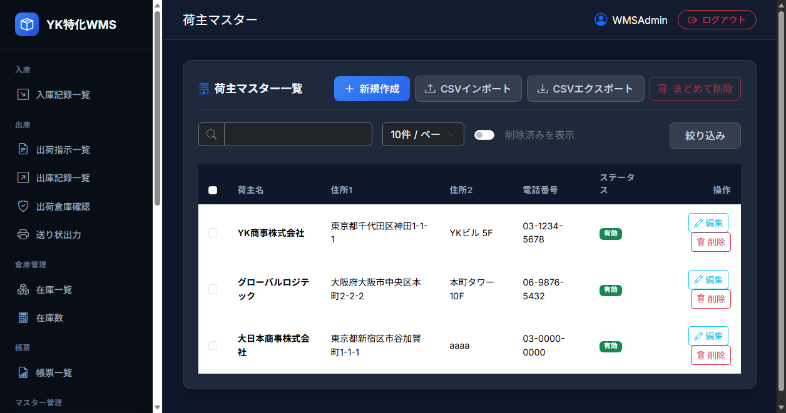
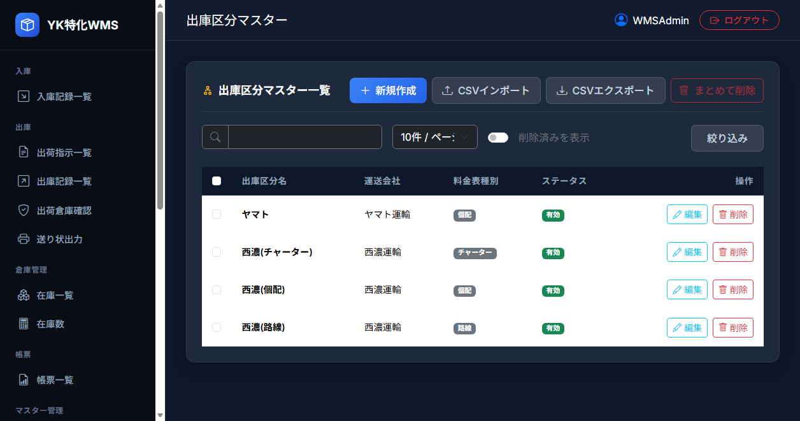
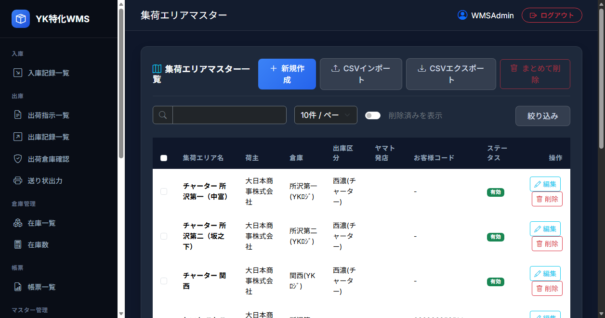
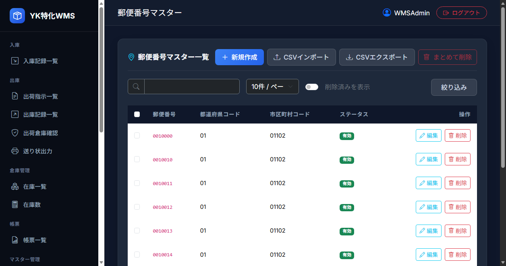
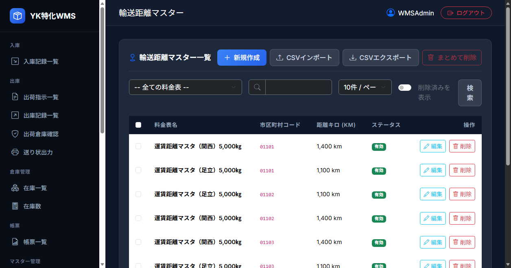
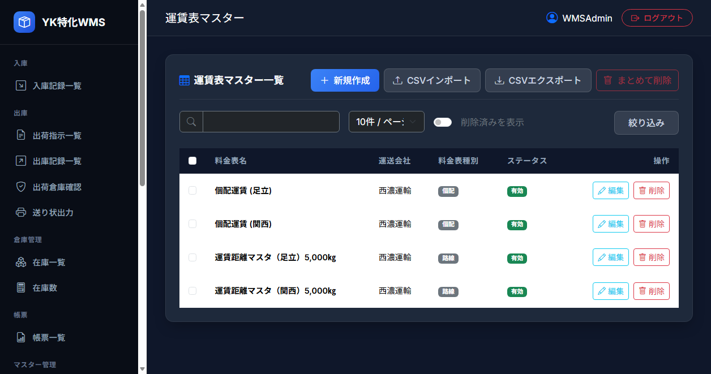
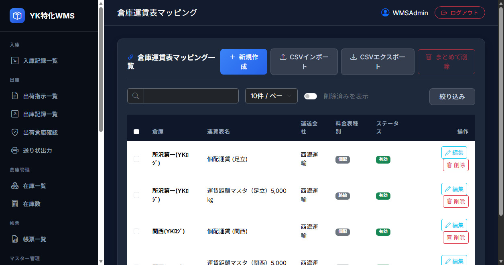
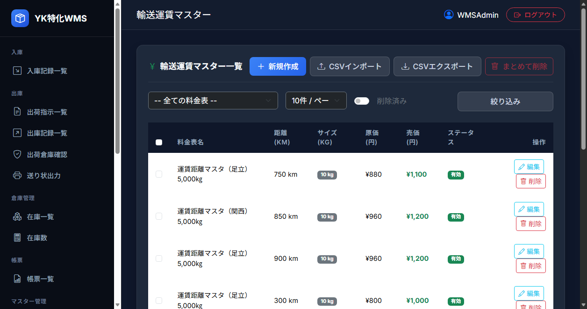
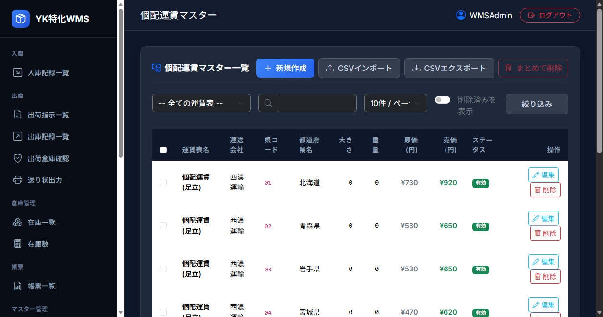

# 機能設計書 - マスタ管理

本システムを構成する各種マスタデータ（荷主、倉庫、商品、運送会社、運賃表等）のCRUD操作（一覧表示・登録・編集・論理削除）およびCSV入出力を行うマスタ管理システム。

---

## 1. マスタ管理共通仕様

すべてのマスタ管理画面は、共通のコントローラー設計およびビュー構成に基づいており、一貫した操作とバックエンド処理が提供される。

### 1.1 画面共通機能
* **一覧表示（Index）**:  
  マスタテーブルに登録されているデータを表形式で表示する。
  * ページングに対応しており、1ページあたりの表示件数を 10, 20, 50, 100 件から選択可能（選択された件数はクッキー `PageSize_Master_{マスタ名}` に保存される）。
  * テキストによるあいまい検索（名称検索等）をサポート。
  * **無効データの表示切り替え（`showDeleted`）**:  
    チェックボックスのON/OFFにより、論理削除されたデータを一覧に表示するかどうかを切り替えることができる。
* **新規保存および更新（Save）**:  
  画面上で単一レコードを登録または更新する。
  * 主キー（Guid）が空の場合は `Guid.NewGuid()` により自動発番して新規追加する。主キーが存在する場合は、既存レコードの値を上書き更新する。
* **個別論理削除（Delete）**:  
  各行の「削除」ボタン押下により、物理的なレコード削除は行わず、削除フラグ（`IsDeleted`）を `true` に更新する（論理削除）。
* **無効化解除・復元（Restore）**:  
  論理削除されて無効になっているデータに対して「復元」ボタンを押下することで、削除フラグ（`IsDeleted`）を `false` に戻し、再び有効データとして利用可能にする。
* **一括削除（BatchDelete）**:  
  一覧左端のチェックボックスで複数選択したレコードをまとめて論理削除する。

### 1.2 CSVデータ入出力機能
* **CSVエクスポート（ExportCsv）**:  
  現在マスタに登録されている有効な全レコードを、CSV形式（UTF-8エンコード、ヘッダーあり）で一括ダウンロードする。
* **CSVインポート（ImportCsv）**:  
  CSVファイルをアップロードしてマスタデータの一括登録・更新を行う。
  * 1行目をヘッダーとしてスキップし、2行目以降を取り込む。
  * **新規/更新の自動判別**:  
    CSVのID列（主キー）が空白の場合は新規レコードとしてGuidを発番して登録する。ID列に値が設定されている場合は既存レコードを検索し、存在すれば上書き更新する。
  * **未存在時の挙動オプション（`createIfNotFound`）**:  
    IDが指定されているがデータベースに存在しない場合、フラグが `true` であれば指定されたIDで新規作成を行い、`false` の場合は処理を中断しエラー（ロールバック）とする。

### 1.3 監査項目と自動論理削除制御
本システムは Entity Framework Core の `DbContext.SaveChanges()` 割り込み処理（`ApplyAuditAndSoftDelete`）により、以下の監査項目および削除フラグを自動制御する。
* **論理削除クエリフィルタ**:  
  通常クエリでは `IsDeleted = false` のデータのみが自動的に抽出される。論理削除済みのデータを検索する場合は、`IgnoreQueryFilters()` を明示的に呼び出してクエリを行う。
* **監査項目の自動設定**:  
  レコード作成時に `CreatedBy` (登録ユーザー) および `CreatedAt` (登録日時) を設定し、更新/削除時に `UpdatedBy` (更新ユーザー) および `UpdatedAt` (更新日時) を自動設定する。ユーザー名はログインセッションから取得する（未ログイン時は `"SYSTEM"`）。

---

## 2. 各種マスタ定義

本システムで管理される12種のマスタ定義は以下の通り。

### 2.1 荷主マスタ
* **物理テーブル名**: `m_shipper`
* **機能概要**: 所有権を持つ商品の保管・出荷を依頼する顧客（荷主）情報を管理する。
* **画面キャプチャ**:
  
* **画面説明および操作ガイド**:
  * **一覧ヘッダー部**: 検索キーワード入力フォーム、無効データの表示ON/OFF切り替えチェックボックス、CSVインポート/エクスポートボタン、および新規登録モーダル呼び出しボタンが配置されている。
  * **データ一覧テーブル**: 荷主ID、荷主名、住所１・住所２、電話番号がグリッド形式で表示される。右側の「操作」列には「編集」および「削除」（無効化）ボタンが配置され、無効データ表示時は「復元」ボタンに変化する。
  * **主要画面項目**:
    * 荷主名（`shipper_name`）: 必須、最大64文字
    * 荷主住所1（`shipper_address1`）: 必須、最大64文字
    * 荷主住所2（`shipper_address2`）: 必須、最大64文字
    * 荷主電話番号（`shipper_tel`）: 必須、最大16文字
* **テーブル物理定義**:

| 論理名 | 物理名 | 主キー | 必須 | 型 | サイズ | 備考 |
| :--- | :--- | :---: | :---: | :--- | :---: | :--- |
| **荷主ID** | `shipper_id` | 〇 | 〇 | uniqueidentifier | - | 主キー（Guid） |
| **荷主名** | `shipper_name` | | 〇 | nvarchar | 64 | |
| **荷主住所１** | `shipper_address1` | | 〇 | nvarchar | 64 | 都道府県・市区町村・番地 |
| **荷主住所２** | `shipper_address2` | | 〇 | nvarchar | 64 | ビル名・マンション名など |
| **荷主電話番号** | `shipper_tel` | | 〇 | varchar | 16 | |
| **削除フラグ** | `is_deleted` | | 〇 | bit | - | 初期値: false（論理削除） |
| **登録ユーザー** | `created_by` | | | nvarchar | 64 | |
| **登録日時** | `created_at` | | | datetime | - | |
| **更新ユーザー** | `updated_by` | | | nvarchar | 64 | |
| **更新日時** | `updated_at` | | | datetime | - | |

---

### 2.2 倉庫マスタ
* **物理テーブル名**: `m_warehouse`
* **機能概要**: 在庫を保管する自社または提携先の物�### 2.5 出庫区分マスタ
* **物理テーブル名**: `m_shipping_class`
* **機能概要**: 各運送会社における出庫種別（サイズや対応する運賃表の種別）を管理する。
* **画面キャプチャ**:
  
* **画面説明および操作ガイド**:
  * **一覧表示**: 出庫区分名、紐づく運送会社、および運賃表種別（個配/路線/チャーター）をバッジ形式で一覧表示する。
  * **登録・編集フォーム**: 運送会社をコンボボックスから選択し、区分名と運賃表種別を設定する。
  * **主要画面項目**:
    * 運送会社（`carrier_id`）: 必須、コンボ選択（運送会社マスタより）
    * 区分名（`class_name`）: 必須、最大64文字
    * 運賃表種別（`rate_table_type`）: 必須、コンボ選択（1:個配, 2:路線, 3:チャーター）
* **テーブル物理定義**:

| 論理名 | 物理名 | 主キー | 必須 | 型 | サイズ | 備考 |
| :--- | :--- | :---: | :---: | :--- | :---: | :--- |
| **出庫区分ID** | `shipping_class_id` | 〇 | 〇 | uniqueidentifier | - | 主キー（Guid） |
| **運送会社ID** | `carrier_id` | | 〇 | uniqueidentifier | - | 外部キー（`m_carrier.carrier_id`） |
| **区分名** | `class_name` | | 〇 | nvarchar | 64 | (例: ヤマト個配、佐川路線など) |
| **運賃表種別** | `rate_table_type` | | 〇 | int | - | `1`: 個配、`2`: 路線、`3`: チャーター |
| **削除フラグ** | `is_deleted` | | 〇 | bit | - | 初期値: false |
| **登録ユーザー** | `created_by` | | | nvarchar | 64 | |
| **登録日時** | `created_at` | | | datetime | - | |
| **更新ユーザー** | `updated_by` | | | nvarchar | 64 | |
| **更新日時** | `updated_at` | | | datetime | - | |

---

### 2.6 集荷エリアマスタ
* **物理テーブル名**: `m_collection_area`
* **機能概要**: 「荷主 × 出庫区分 × 倉庫」の組み合わせにおいて適用される、運送会社引き渡し用の「荷送人コード」等の伝票印字用設定を管理する。
* **画面キャプチャ**:
  
* **画面説明および操作ガイド**:
  * **一覧表示**: 集荷エリア名、荷主、出庫区分、倉庫、伝票種別、ヤマトコード（店舗・顧客・枝番）、荷送人コードを一覧表示する。
  * **設定画面**: 荷主・出庫区分・倉庫のコンボボックス連携と、運送会社別顧客・伝票印字情報の詳細を設定する。
  * **主要画面項目**:
    * 荷主（`shipper_id`）: 必須、コンボ選択
    * 出庫区分（`shipping_class_id`）: 必須、コンボ選択
    * 倉庫（`warehouse_id`）: 必須、コンボ選択
    * 集荷エリア名（`area_name`）: 必須、最大64文字
    * 伝票種別（`invoice_type`）: 数値
    * ヤマト店舗コード（`yamato_shop_code`）: 最大6文字
    * ヤマト顧客コード（`yamato_customer_code`）: 最大12文字
    * ヤマト枝番（`yamato_sub_code`）: 最大3文字
    * ヤマト運賃管理（`yamato_freight_mgmt`）: 数値
    * 荷送人コード（`sender_code`）: 任意、最大12文字（出庫確定時に送り状データにセットされる）
* **テーブル物理定義**:

| 論理名 | 物理名 | 主キー | 必須 | 型 | サイズ | 備考 |
| :--- | :--- | :---: | :---: | :--- | :---: | :--- |
| **集荷エリアID** | `area_id` | 〇 | 〇 | uniqueidentifier | - | 主キー（Guid） |
| **荷主ID** | `shipper_id` | | 〇 | uniqueidentifier | - | 外部キー（`m_shipper`） |
| **出庫区分ID** | `shipping_class_id` | | 〇 | uniqueidentifier | - | 外部キー（`m_shipping_class`） |
| **倉庫ID** | `warehouse_id` | | 〇 | uniqueidentifier | - | 外部キー（`m_warehouse`） |
| **集荷エリア名** | `area_name` | | 〇 | nvarchar | 64 | |
| **伝票種別** | `invoice_type` | | 〇 | int | - | |
| **ヤマト店舗コード** | `yamato_shop_code` | | | varchar | 6 | |
| **ヤマト顧客コード** | `yamato_customer_code` | | | varchar | 12 | |
| **ヤマト枝番** | `yamato_sub_code` | | | varchar | 3 | |
| **ヤマト運賃管理** | `yamato_freight_mgmt` | | 〇 | int | - | |
| **荷送人コード** | `sender_code` | | | varchar | 12 | |
| **削除フラグ** | `is_deleted` | | 〇 | bit | - | 初期値: false |
| **登録ユーザー** | `created_by` | | | nvarchar | 64 | |
| **登録日時** | `created_at` | | | datetime | - | |
| **更新ユーザー** | `updated_by` | | | nvarchar | 64 | |
| **更新日時** | `updated_at` | | | datetime | - | |

---

### 2.7 郵便番号マスタ
* **物理テーブル名**: `m_zip_code`
* **機能概要**: 日本全国の郵便番号に対応する都道府県および市区町村コードのマッピング。出荷指示書の郵便番号から届け先市区町村コードを一意に特定するために使用する。
* **画面キャプチャ**:
  
* **画面説明および操作ガイド**:
  * **一覧表示**: 郵便番号（7桁ハイフンなし）、都道府県コード（2桁）、市区町村コード（5桁）を登録・閲覧できる。
  * **主要画面項目**:
    * 郵便番号（`zip_code`）: 必須、最大7文字（主キー。ハイフンなし）
    * 都道府県コード（`pref_code`）: 必須、最大2文字
    * 市区町村コード（`city_code`）: 必須、最大5文字
* **テーブル物理定義**:

| 論理名 | 物理名 | 主キー | 必須 | 型 | サイズ | 備考 |
| :--- | :--- | :---: | :---: | :--- | :---: | :--- |
| **郵便番号** | `zip_code` | 〇 | 〇 | varchar | 7 | 主キー（ハイフンなし） |
| **都道府県コード** | `pref_code` | | 〇 | varchar | 2 | 全国地方公共団体コードの上2桁 |
| **市区町村コード** | `city_code` | | 〇 | varchar | 5 | 全国地方公共団体コードの5桁 |
| **削除フラグ** | `is_deleted` | | 〇 | bit | - | 初期値: false |
| **登録ユーザー** | `created_by` | | | nvarchar | 64 | |
| **登録日時** | `created_at` | | | datetime | - | |
| **更新ユーザー** | `updated_by` | | | nvarchar | 64 | |
| **更新日時** | `updated_at` | | | datetime | - | |

---

### 2.8 距離マスタ
* **物理テーブル名**: `m_distance`
* **主キー**: `distance_rate_id` + `city_code` (複合キー)
* **機能概要**: 特定の運賃計算区分（料金表）と市区町村コードの間における配送距離（km）を設定する。
* **画面キャプチャ**:
  
* **画面説明および操作ガイド**:
  * **一覧表示**: 運賃表名、対象の市区町村コード、実距離(km)を表示する。
  * **主要画面項目**:
    * 運賃表（`distance_rate_id`）: 必須、コンボ選択（運賃表マスタより）
    * 市区町村コード（`city_code`）: 必須、最大5文字
    * 距離 (km)（`distance_km`）: 必須、数値
* **テーブル物理定義**:

| 論理名 | 物理名 | 主キー | 必須 | 型 | サイズ | 備考 |
| :--- | :--- | :---: | :---: | :--- | :---: | :--- |
| **運賃表ID** | `freight_table_id` | 〇 | 〇 | uniqueidentifier | - | 主キーの一部（外部キー `m_freight_table`） |
| **市区町村コード** | `city_code` | 〇 | 〇 | varchar | 5 | 主キーの一部（地方公共団体コード） |
| **距離 (km)** | `distance_km` | | 〇 | int | - | 配送距離実キロ数 |
| **削除フラグ** | `is_deleted` | | 〇 | bit | - | 初期値: false |
| **登録ユーザー** | `created_by` | | | nvarchar | 64 | |
| **登録日時** | `created_at` | | | datetime | - | |
| **更新ユーザー** | `updated_by` | | | nvarchar | 64 | |
| **更新日時** | `updated_at` | | | datetime | - | |

---

### 2.9 運賃表マスタ
* **物理テーブル名**: `m_freight_table`
* **機能概要**: 各運送会社が提供する距離別運賃の基本テーブル定義。
* **画面キャプチャ**:
  
* **画面説明および操作ガイド**:
  * **一覧表示**: 料金表名、運賃表種別（個配・路線・チャーター）、担当運送会社を一覧表示。
  * **主要画面項目**:
    * 料金表名（`rate_name`）: 必須、最大64文字
    * 運賃表種別（`rate_table_type`）: 必須、コンボ選択（1:個配, 2:路線, 3:チャーター）
    * 運送会社（`carrier_id`）: 必須、コンボ選択（運送会社マスタより）
* **テーブル物理定義**:

| 論理名 | 物理名 | 主キー | 必須 | 型 | サイズ | 備考 |
| :--- | :--- | :---: | :---: | :--- | :---: | :--- |
| **運賃表ID** | `freight_table_id` | 〇 | 〇 | uniqueidentifier | - | 主キー（Guid） |
| **料金表名** | `rate_name` | | 〇 | nvarchar | 64 | |
| **運賃表種別** | `rate_table_type` | | 〇 | int | - | `1`: 個配、`2`: 路線、`3`: チャーター |
| **運送会社ID** | `carrier_id` | | 〇 | uniqueidentifier | - | 外部キー（`m_carrier.carrier_id`） |
| **削除フラグ** | `is_deleted` | | 〇 | bit | - | 初期値: false |
| **登録ユーザー** | `created_by` | | | nvarchar | 64 | |
| **登録日時** | `created_at` | | | datetime | - | |
| **更新ユーザー** | `updated_by` | | | nvarchar | 64 | |
| **更新日時** | `updated_at` | | | datetime | - | |

---

### 2.10 倉庫運賃表マッピングマスタ
* **物理テーブル名**: `m_warehouse_distance_rate`
* **主キー**: `warehouse_id` + `freight_table_id` (複合キー)
* **機能概要**: 出荷倉庫と適用される運賃表とのマッピング関係。最安倉庫自動選定処理において、対象倉庫が選択された運送会社に対してどの運賃表を利用するかを判断する基準となる。
* **画面キャプチャ**:
  
* **画面説明および操作ガイド**:
  * **一覧表示**: 倉庫名、紐づく料金表名、料金表種別バッジを表示。
  * **主要画面項目**:
    * 倉庫（`warehouse_id`）: 必須、コンボ選択
    * 運賃表（`freight_table_id`）: 必須、コンボ選択
    * 一覧表示には、紐づく運賃表マスタの「料金表種別（1:個配, 2:路線, 3:チャーター）」をバッジ形式で表示する。
* **テーブル物理定義**:

| 論理名 | 物理名 | 主キー | 必須 | 型 | サイズ | 備考 |
| :--- | :--- | :---: | :---: | :--- | :---: | :--- |
| **倉庫ID** | `warehouse_id` | 〇 | 〇 | uniqueidentifier | - | 主キーの一部（外部キー `m_warehouse`） |
| **運賃表ID** | `freight_table_id` | 〇 | 〇 | uniqueidentifier | - | 主キーの一部（外部キー `m_freight_table`） |
| **削除フラグ** | `is_deleted` | | 〇 | bit | - | 初期値: false |
| **登録ユーザー** | `created_by` | | | nvarchar | 64 | |
| **登録日時** | `created_at` | | | datetime | - | |
| **更新ユーザー** | `updated_by` | | | nvarchar | 64 | |
| **更新日時** | `updated_at` | | | datetime | - | |

---

### 2.11 輸送距離運賃マスタ
* **物理テーブル名**: `m_distance_freight`
* **機能概要**: 各運賃表における「重量サイズ × 距離キロ数」ごとの運賃金額（基本価格）および原価を設定する。最安値の自動選定や送り状出力時の売上計上に直接使用されるコアマスタ。
* **画面キャプチャ**:
  
* **画面説明および操作ガイド**:
  * **一覧表示**: 運賃表、適用距離上限(km)、サイズ区分、原価、請求料金を表示する。
  * **主要画面項目**:
    * 運賃表（`freight_table_id`）: 必須、コンボ選択
    * 距離 (km)（`distance_km`）: 必須、数値（このキロ数「以下」をカバーする）
    * サイズ/重量（`size`）: 必須、数値（出荷総重量などの換算値）
    * 原価（`cost`）: 数値
    * 料金（`price`）: 必須、数値
* **テーブル物理定義**:

| 論理名 | 物理名 | 主キー | 必須 | 型 | サイズ | 備考 |
| :--- | :--- | :---: | :---: | :--- | :---: | :--- |
| **運賃運送ID** | `freight_id` | 〇 | 〇 | uniqueidentifier | - | 主キー（Guid） |
| **運賃表ID** | `freight_table_id` | | 〇 | uniqueidentifier | - | 外部キー（`m_freight_table.freight_table_id`） |
| **距離 (km)** | `distance_km` | | 〇 | int | - | 最大適用距離 |
| **サイズ** | `size` | | 〇 | int | - | 重量等のサイズ区分値 |
| **原価** | `cost` | | | int | - | 運送会社への支払原価 |
| **料金** | `price` | | 〇 | int | - | 顧客への請求料金 |
| **削除フラグ** | `is_deleted` | | 〇 | bit | - | 初期値: false |
| **登録ユーザー** | `created_by` | | | nvarchar | 64 | |
| **登録日時** | `created_at` | | | datetime | - | |
| **更新ユーザー** | `updated_by` | | | nvarchar | 64 | |
| **更新日時** | `updated_at` | | | datetime | - | |

---

### 2.12 個配運賃マスタ
* **物理テーブル名**: `m_individual_freight`
* **機能概要**: 都道府県ごとの個配運賃料金（大きさ・重量・原価・売価）を設定・管理する。
* **画面キャプチャ**:
  
* **画面説明および操作ガイド**:
  * **一覧表示**: 運賃表、都道府県コード、都道府県名、大きさ、重量、原価(円)、売価(円)を一覧表示する。47都道府県の一括シード設定に対応。
  * **主要画面項目**:
    * 運賃表（`freight_table_id`）: 必須、コンボ選択（運賃表マスタより）
    * 県コード（`pref_code`）: 必須、2文字
    * 都道府県名（`pref_name`）: 必須、最大32文字
    * 大きさ（`size`）: 必須、数値（整数）
    * 重量（`weight`）: 必須、数値（整数）
    * 原価（`cost`）: 必須、数値（円）
    * 売価（`price`）: 必須、数値（円）
* **テーブル物理定義**:

| 論理名 | 物理名 | 主キー | 必須 | 型 | サイズ | 備考 |
| :--- | :--- | :---: | :---: | :--- | :---: | :--- |
| **個配運賃ID** | `individual_freight_id` | 〇 | 〇 | uniqueidentifier | - | 主キー（Guid） |
| **運賃表ID** | `freight_table_id` | | 〇 | uniqueidentifier | - | 外部キー（`m_freight_table.freight_table_id`） |
| **県コード** | `pref_code` | | 〇 | varchar | 2 | 全国地方公共団体コード上2桁 |
| **都道府県名** | `pref_name` | | 〇 | nvarchar | 32 | |
| **大きさ** | `size` | | 〇 | int | - | 大きさ区分値（整数） |
| **重量** | `weight` | | 〇 | int | - | 重量区分値（整数） |
| **原価** | `cost` | | 〇 | int | - | 運送原価（円） |
| **売価** | `price` | | 〇 | int | - | 配送運賃売価（円） |
| **削除フラグ** | `is_deleted` | | 〇 | bit | - | 初期値: false |
| **登録ユーザー** | `created_by` | | | nvarchar | 64 | |
| **登録日時** | `created_at` | | | datetime | - | |
| **更新ユーザー** | `updated_by` | | | nvarchar | 64 | |
| **更新日時** | `updated_at` | | | datetime | - | |
枝番** | `yamato_sub_code` | | | varchar | 3 | |
| **ヤマト運賃管理** | `yamato_freight_mgmt` | | 〇 | int | - | |
| **荷送人コード** | `sender_code` | | | varchar | 12 | |
| **削除フラグ** | `is_deleted` | | 〇 | bit | - | 初期値: false |
| **登録ユーザー** | `created_by` | | | nvarchar | 64 | |
| **登録日時** | `created_at` | | | datetime | - | |
| **更新ユーザー** | `updated_by` | | | nvarchar | 64 | |
| **更新日時** | `updated_at` | | | datetime | - | |

---

### 2.7 郵便番号マスタ
* **物理テーブル名**: `m_zip_code`
* **機能概要**: 日本全国の郵便番号に対応する都道府県および市区町村コードのマッピング。出荷指示書の郵便番号から届け先市区町村コードを一意に特定するために使用する。
* **主要画面項目**:
  * 郵便番号（`zip_code`）: 必須、最大7文字（主キー。ハイフンなし）
  * 都道府県コード（`pref_code`）: 必須、最大2文字
  * 市区町村コード（`city_code`）: 必須、最大5文字
* **テーブル物理定義**:

| 論理名 | 物理名 | 主キー | 必須 | 型 | サイズ | 備考 |
| :--- | :--- | :---: | :---: | :--- | :---: | :--- |
| **郵便番号** | `zip_code` | 〇 | 〇 | varchar | 7 | 主キー（ハイフンなし） |
| **都道府県コード** | `pref_code` | | 〇 | varchar | 2 | 全国地方公共団体コードの上2桁 |
| **市区町村コード** | `city_code` | | 〇 | varchar | 5 | 全国地方公共団体コードの5桁 |
| **削除フラグ** | `is_deleted` | | 〇 | bit | - | 初期値: false |
| **登録ユーザー** | `created_by` | | | nvarchar | 64 | |
| **登録日時** | `created_at` | | | datetime | - | |
| **更新ユーザー** | `updated_by` | | | nvarchar | 64 | |
| **更新日時** | `updated_at` | | | datetime | - | |

---

### 2.8 距離マスタ
* **物理テーブル名**: `m_distance`
* **主キー**: `distance_rate_id` + `city_code` (複合キー)
* **機能概要**: 特定の運賃計算区分（料金表）と市区町村コードの間における配送距離（km）を設定する。
* **主要画面項目**:
  * 運賃表（`distance_rate_id`）: 必須、コンボ選択（運賃表マスタより）
  * 市区町村コード（`city_code`）: 必須、最大5文字
  * 距離 (km)（`distance_km`）: 必須、数値
* **テーブル物理定義**:

| 論理名 | 物理名 | 主キー | 必須 | 型 | サイズ | 備考 |
| :--- | :--- | :---: | :---: | :--- | :---: | :--- |
| **運賃表ID** | `freight_table_id` | 〇 | 〇 | uniqueidentifier | - | 主キーの一部（外部キー `m_freight_table`） |
| **市区町村コード** | `city_code` | 〇 | 〇 | varchar | 5 | 主キーの一部（地方公共団体コード） |
| **距離 (km)** | `distance_km` | | 〇 | int | - | 配送距離実キロ数 |
| **削除フラグ** | `is_deleted` | | 〇 | bit | - | 初期値: false |
| **登録ユーザー** | `created_by` | | | nvarchar | 64 | |
| **登録日時** | `created_at` | | | datetime | - | |
| **更新ユーザー** | `updated_by` | | | nvarchar | 64 | |
| **更新日時** | `updated_at` | | | datetime | - | |

---

### 2.9 運賃表マスタ
* **物理テーブル名**: `m_freight_table`
* **機能概要**: 各運送会社が提供する距離別運賃の基本テーブル定義。
* **主要画面項目**:
  * 料金表名（`rate_name`）: 必須、最大64文字
  * 運賃表種別（`rate_table_type`）: 必須、コンボ選択（1:個配, 2:路線, 3:チャーター）
  * 運送会社（`carrier_id`）: 必須、コンボ選択（運送会社マスタより）
* **テーブル物理定義**:

| 論理名 | 物理名 | 主キー | 必須 | 型 | サイズ | 備考 |
| :--- | :--- | :---: | :---: | :--- | :---: | :--- |
| **運賃表ID** | `freight_table_id` | 〇 | 〇 | uniqueidentifier | - | 主キー（Guid） |
| **料金表名** | `rate_name` | | 〇 | nvarchar | 64 | |
| **運賃表種別** | `rate_table_type` | | 〇 | int | - | `1`: 個配、`2`: 路線、`3`: チャーター |
| **運送会社ID** | `carrier_id` | | 〇 | uniqueidentifier | - | 外部キー（`m_carrier.carrier_id`） |
| **削除フラグ** | `is_deleted` | | 〇 | bit | - | 初期値: false |
| **登録ユーザー** | `created_by` | | | nvarchar | 64 | |
| **登録日時** | `created_at` | | | datetime | - | |
| **更新ユーザー** | `updated_by` | | | nvarchar | 64 | |
| **更新日時** | `updated_at` | | | datetime | - | |

---

### 2.10 倉庫運賃表マッピングマスタ
* **物理テーブル名**: `m_warehouse_distance_rate`
* **主キー**: `warehouse_id` + `freight_table_id` (複合キー)
* **機能概要**: 出荷倉庫と適用される運賃表とのマッピング関係。最安倉庫自動選定処理において、対象倉庫が選択された運送会社に対してどの運賃表を利用するかを判断する基準となる。
* **主要画面項目**:
  * 倉庫（`warehouse_id`）: 必須、コンボ選択
  * 運賃表（`freight_table_id`）: 必須、コンボ選択
  * 一覧表示には、紐づく運賃表マスタの「料金表種別（1:個配, 2:路線, 3:チャーター）」をバッジ形式で表示する。
* **テーブル物理定義**:

| 論理名 | 物理名 | 主キー | 必須 | 型 | サイズ | 備考 |
| :--- | :--- | :---: | :---: | :--- | :---: | :--- |
| **倉庫ID** | `warehouse_id` | 〇 | 〇 | uniqueidentifier | - | 主キーの一部（外部キー `m_warehouse`） |
| **運賃表ID** | `freight_table_id` | 〇 | 〇 | uniqueidentifier | - | 主キーの一部（外部キー `m_freight_table`） |
| **削除フラグ** | `is_deleted` | | 〇 | bit | - | 初期値: false |
| **登録ユーザー** | `created_by` | | | nvarchar | 64 | |
| **登録日時** | `created_at` | | | datetime | - | |
| **更新ユーザー** | `updated_by` | | | nvarchar | 64 | |
| **更新日時** | `updated_at` | | | datetime | - | |

---

### 2.11 輸送距離運賃マスタ
* **物理テーブル名**: `m_distance_freight`
* **機能概要**: 各運賃表における「重量サイズ × 距離キロ数」ごとの運賃金額（基本価格）および原価を設定する。最安値の自動選定や送り状出力時の売上計上に直接使用されるコアマスタ。
* **主要画面項目**:
  * 運賃表（`freight_table_id`）: 必須、コンボ選択
  * 距離 (km)（`distance_km`）: 必須、数値（このキロ数「以下」をカバーする）
  * サイズ/重量（`size`）: 必須、数値（出荷総重量などの換算値）
  * 原価（`cost`）: 数値
  * 料金（`price`）: 必須、数値
* **テーブル物理定義**:

| 論理名 | 物理名 | 主キー | 必須 | 型 | サイズ | 備考 |
| :--- | :--- | :---: | :---: | :--- | :---: | :--- |
| **運賃運送ID** | `freight_id` | 〇 | 〇 | uniqueidentifier | - | 主キー（Guid） |
| **運賃表ID** | `freight_table_id` | | 〇 | uniqueidentifier | - | 外部キー（`m_freight_table.freight_table_id`） |
| **距離 (km)** | `distance_km` | | 〇 | int | - | 最大適用距離 |
| **サイズ** | `size` | | 〇 | int | - | 重量等のサイズ区分値 |
| **原価** | `cost` | | | int | - | 運送会社への支払原価 |
| **料金** | `price` | | 〇 | int | - | 顧客への請求料金 |
| **削除フラグ** | `is_deleted` | | 〇 | bit | - | 初期値: false |
| **登録ユーザー** | `created_by` | | | nvarchar | 64 | |
| **登録日時** | `created_at` | | | datetime | - | |
| **更新ユーザー** | `updated_by` | | | nvarchar | 64 | |
| **更新日時** | `updated_at` | | | datetime | - | |

---

### 2.12 個配運賃マスタ
* **物理テーブル名**: `m_individual_freight`
* **機能概要**: 都道府県ごとの個配運賃料金（大きさ・重量・原価・売価）を設定・管理する。
* **主要画面項目**:
  * 運賃表（`freight_table_id`）: 必須、コンボ選択（運賃表マスタより）
  * 県コード（`pref_code`）: 必須、2文字
  * 都道府県名（`pref_name`）: 必須、最大32文字
  * 大きさ（`size`）: 必須、数値（整数）
  * 重量（`weight`）: 必須、数値（整数）
  * 原価（`cost`）: 必須、数値（円）
  * 売価（`price`）: 必須、数値（円）
* **テーブル物理定義**:

| 論理名 | 物理名 | 主キー | 必須 | 型 | サイズ | 備考 |
| :--- | :--- | :---: | :---: | :--- | :---: | :--- |
| **個配運賃ID** | `individual_freight_id` | 〇 | 〇 | uniqueidentifier | - | 主キー（Guid） |
| **運賃表ID** | `freight_table_id` | | 〇 | uniqueidentifier | - | 外部キー（`m_freight_table.freight_table_id`） |
| **県コード** | `pref_code` | | 〇 | varchar | 2 | 全国地方公共団体コード上2桁 |
| **都道府県名** | `pref_name` | | 〇 | nvarchar | 32 | |
| **大きさ** | `size` | | 〇 | int | - | 大きさ区分値（整数） |
| **重量** | `weight` | | 〇 | int | - | 重量区分値（整数） |
| **原価** | `cost` | | 〇 | int | - | 運送原価（円） |
| **売価** | `price` | | 〇 | int | - | 配送運賃売価（円） |
| **削除フラグ** | `is_deleted` | | 〇 | bit | - | 初期値: false |
| **登録ユーザー** | `created_by` | | | nvarchar | 64 | |
| **登録日時** | `created_at` | | | datetime | - | |
| **更新ユーザー** | `updated_by` | | | nvarchar | 64 | |
| **更新日時** | `updated_at` | | | datetime | - | |

