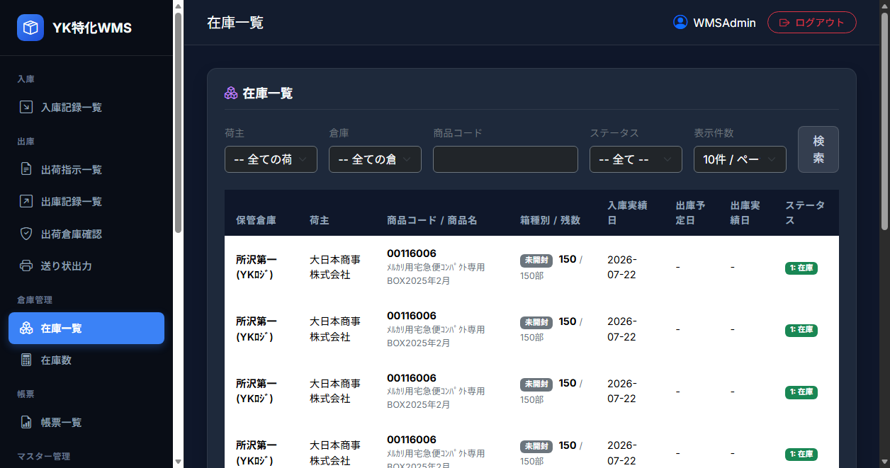
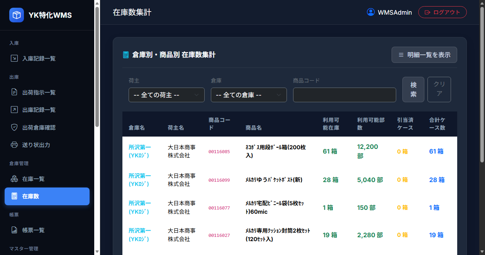
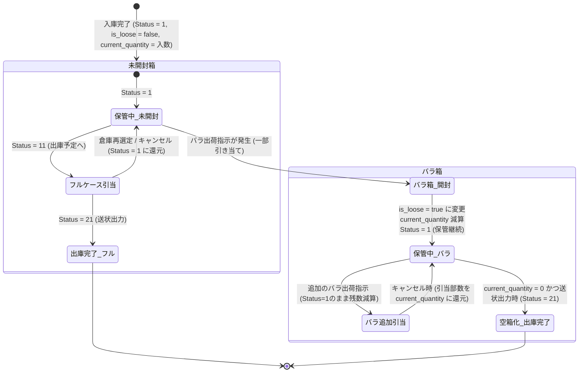

# 機能設計書 - 倉庫管理（在庫管理）

本システムにおける保管中の商品在庫情報の照会、明細確認、および各種入出庫ステータス（在庫・引当・出庫済）に応じた集計数管理および**バラ箱（残数管理）**を行う一連の倉庫管理（在庫管理）システム。

---

## 1. メニュー構成

倉庫管理機能のメニューおよび画面遷移は以下の通り。

```
倉庫管理
├─ 在庫一覧（/Inventory/List） ※明細一覧画面
└─ 在庫数（/Inventory/Summary） ※倉庫別・商品別集計画面
```

---

## 2. 在庫一覧 (Inventory List)

### 2.1 機能概要
倉庫に保管されている商品ケース（`t_inventory`）の明細データを一覧で検索・照会する。未開封箱とバラ箱の区別、および箱内の残存部数をリアルタイムで確認可能。

### 2.2 画面キャプチャ


### 2.3 画面構成および操作ガイド
在庫一覧画面は、以下の検索フィルター、ページサイズ設定、明細リスト、およびページングコントロールで構成される。

* **検索条件フィルター**: 荷主、倉庫、商品コード（部分一致）、およびステータス（1:在庫, 11:引当, 21:出庫）を柔軟に組み合わせて絞り込むことができる。
* **表示切り替え**: 1ページあたりの表示件数（10, 20, 50, 100件）をクッキー連動で保存・変更できる。
* **明細表示**: 各在庫ケースが「未開封」か「バラ箱（残数/入数表示）」かを一目で識別可能。

| コントロール | 説明 |
| :--- | :--- |
| **荷主検索選択** | 登録されている荷主から特定の荷主で絞り込む（コンボボックス、初期値: 全ての荷主）。選択変更時に自動検索が走る。 |
| **倉庫検索選択** | 登録されている倉庫から特定の倉庫で絞り込む（コンボボックス、初期値: 全ての倉庫）。選択変更時に自動検索が走る。 |
| **商品コード検索入力** | 商品IDの一部（部分一致）によるテキスト検索フォーム。 |
| **ステータス検索選択** | 特定の在庫ステータスで絞り込む（コンボボックス、初期値: 全て）。選択変更時に自動検索が走る。 |
| **表示件数選択（ページサイズ）** | 1ページあたりの表示件数を 10, 20, 50, 100 件から選択（選択値はクッキー `PageSize_Inventory_List` に保存）。 |
| **検索ボタン** | 押下すると、指定された条件で再検索し、明細リストを更新する。 |

### 2.4 リスト表示項目
在庫一覧に表示される項目は以下の通り。

| カラム名 | 表示内容 | 紐づくデータ項目 |
| :--- | :--- | :--- |
| **保管倉庫** | 在庫が保管されている倉庫名 | 倉庫名（`m_warehouse.warehouse_name`） |
| **荷主** | 該当商品の所有者である荷主名 | 荷主名（`m_shipper.shipper_name`） |
| **商品コード / 商品名** | 商品ID、および紐づく商品マスタの商品名 | 商品ID（`t_inventory.product_id`） / 商品名（`m_product.product_name`） |
| **箱種別 / 残数** | 箱の種別（未開封 / バラ箱）および箱内の残り部数 / ケース入数 | バラ箱フラグ（`t_inventory.is_loose`） / 残存部数（`t_inventory.current_quantity`） |
| **入庫実績日** | 在庫が実際に倉庫に入庫された日時 | 入庫実績日（`t_inventory.actual_inbound_date`） （yyyy-MM-dd表記） |
| **出庫予定日** | 引当された出庫データの出庫予定日 | 出庫予定日（`t_outbound_allocation` 経由の出庫予定日） |
| **出庫実績日** | 送り状出力によって出庫が確定した日付 | 出庫実績日（`t_inventory.actual_outbound_date`） |
| **ステータス** | 在庫の現在状態を表すステータスバッジ（「1: 在庫」「11: 引当」「21: 出庫」） | ステータス（`t_inventory.status`） |

---

## 3. 在庫数 (Inventory Summary)

### 3.1 機能概要
倉庫・荷主・商品の組み合わせ単位で、保管中（利用可能）な在庫（ケース数および総部数）、および出荷予定として確保（引当）されている数量を集計表示する（※出庫完了済みの在庫は集計対象から除外）。

### 3.2 画面キャプチャ


### 3.3 画面構成および操作ガイド
* **集計表構成**: 倉庫×荷主×商品ごとに実在庫のケース数・バラ部数をリアルタイム集計。
* **数値項目の見方**: 
  * 「利用可能在庫」は即時引き当て可能な保管箱数（未開封＋バラ箱）。
  * 「利用可能部数」はそれらの箱に含まれる部数（実個数）の合計。
  * 「引当済ケース」は出荷処理でキープされている箱数。
  * 「合計ケース数」は倉庫内に存在する有効な全保管ケース数。

### 3.4 リスト表示項目（集計結果）
集計リストの各行は「倉庫ID × 荷主ID × 商品ID」でグループ化（`GroupBy`）された集計結果を表示する（出庫済み `Status = 21` を除外）。

| 項目名 | 表示内容 | 計算ロジック / 紐づくデータ項目 |
| :--- | :--- | :--- |
| **倉庫名** | 倉庫の名称 | 倉庫名（`m_warehouse.warehouse_name`） |
| **荷主名** | 荷主の名称 | 荷主名（`m_shipper.shipper_name`） |
| **商品コード** | 商品コード | 商品ID（`t_inventory.product_id`） |
| **商品名** | 商品の名称（商品マスタに存在しない場合は商品ID） | 商品名（`m_product.product_name`） |
| **利用可能在庫** | 保管中の在庫箱数（未開封箱 ＋ バラ箱の個数） | ステータス（`status`）が `1` の `t_inventory` の件数 |
| **利用可能部数** | 利用可能在庫に対応する総部数（実個数） | ステータス（`status`）が `1` の `t_inventory` の `current_quantity` の総和 |
| **引当済ケース** | 出荷指示読込や手動倉庫調整によって出荷引当中の箱数 | ステータス（`status`）が `11` の `t_inventory` の件数 |
| **合計ケース数** | 該当グループにおける有効な保管ケース総数 | 利用可能在庫（`status = 1`） + 引当済ケース（`status = 11`） |

---

## 4. 在庫ステータス管理とライフサイクル（バラ箱対応）

本システムでは、在庫箱（`t_inventory`）は未開封箱とバラ箱の属性を持ち、引当中間テーブル（`t_outbound_allocation`）を介して出庫データと多対多で連携します。

### 4.1 在庫およびバラ箱のライフサイクル（フロー図）



#### ① 入庫時（在庫の発生）
入庫登録において入庫ステータスが **`11: 確認済`** になった時点で、ケース数分の在庫レコードが生成される。この際、`current_quantity` に商品マスタの入数 (`Product.Quantity`) が初期化セットされ、`is_loose = false`（未開封箱）として登録される。

#### ② バラ出荷発生時の開梱と残存部数管理
バラ出荷（ケース未満部数の出荷指示）が発生した場合：
1. 既存のバラ箱（`is_loose = true` かつ `current_quantity > 0`）から最優先で引き当てる。
2. 不足する場合は未開封箱（`is_loose = false`）を開封し、`is_loose = true` にフラグを変更したうえで必要部数を引当減算する。
3. バラ箱は一部の部数が取り出されても、**残数が 1 部以上ある限りはステータス `1: 保管中` を維持**し、次回以降のバラ出荷の引当対象として倉庫に残る。

#### ③ 送り状出力（最終出庫確定）
送り状が出力されたタイミングで：
* **フルケース箱**: ステータスが `21: 出庫` に更新され、在庫から完全に除外される。
* **バラ箱**: 残数が `0` （`current_quantity == 0`）になった場合のみ、ステータスが `21: 出庫 (空箱化)` に更新され、在庫から除外される。

---

## 5. 関連するトランザクションテーブル

### 5.1 在庫テーブル
* **物理テーブル名**: `t_inventory`
* **主キー**: `inventory_id`

| 論理名 | 物理名 | 主キー | 必須 | 型 | サイズ | 備考 |
| :--- | :--- | :---: | :---: | :--- | :---: | :--- |
| **在庫ID** | `inventory_id` | 〇 | 〇 | uniqueidentifier | - | 自動発番（Guid） |
| **入庫ID** | `inbound_id` | | 〇 | uniqueidentifier | - | 外部キー（`t_inbound.inbound_id`） |
| **荷主ID** | `shipper_id` | | 〇 | uniqueidentifier | - | 外部キー（`m_shipper.shipper_id`） |
| **倉庫ID** | `warehouse_id` | | 〇 | uniqueidentifier | - | 外部キー（`m_warehouse.warehouse_id`） |
| **商品ID** | `product_id` | | 〇 | varchar | 8 | 外部キー（`m_product.product_id`） |
| **残存部数** | `current_quantity` | | 〇 | int | - | **新規追加：現在の箱内残り部数** |
| **バラ箱フラグ** | `is_loose` | | 〇 | bit | - | **新規追加：`false`:未開封, `true`:バラ箱** |
| **入庫実績日** | `actual_inbound_date` | | | datetime | - | 入庫時の実績日 |
| **出庫予定日** | `scheduled_outbound_date` | | | datetime | - | 出庫予定日 |
| **出庫実績日** | `actual_outbound_date` | | | datetime | - | 送り状出力時に設定される出庫確定日 |
| **ステータス** | `status` | | 〇 | int | - | 初期値: 1。<br>`1`: 在庫（保管中）<br>`11`: 引当（予定）<br>`21`: 出庫 |
| **削除フラグ** | `is_deleted` | | 〇 | bit | - | 初期値: false |
