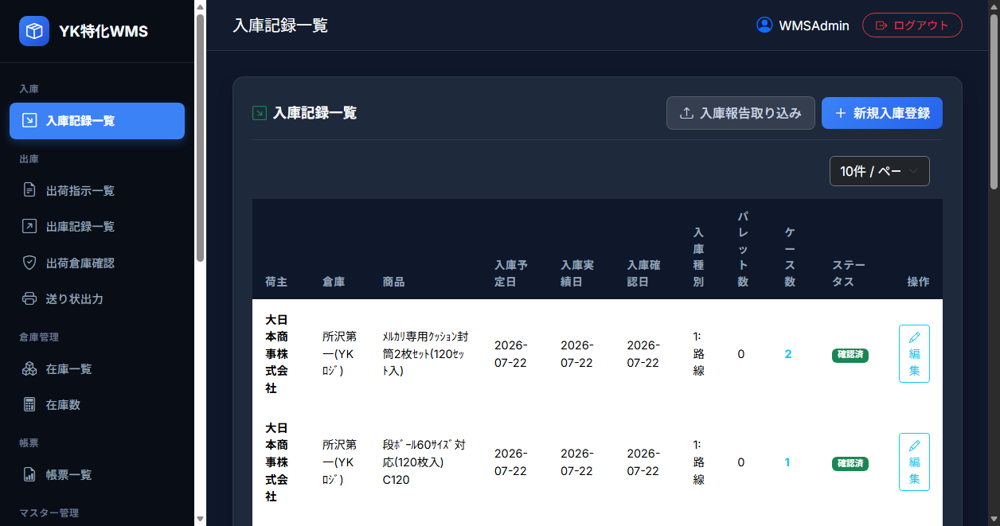
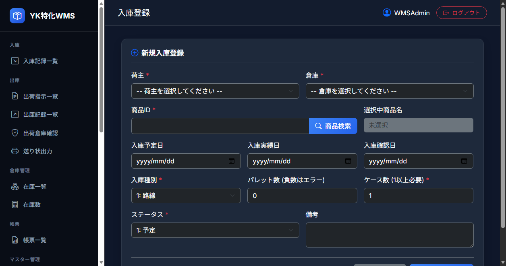

# 機能設計書 - 入庫

倉庫への入庫実績（予定・実績・確認）の記録を行い、ケース数に応じた在庫データ（`t_inventory`）を自動生成して在庫として取り扱う一連の入庫管理システム。

## 1. メニュー構成

入庫管理機能のメニューおよび画面遷移は以下の通り。

```
入庫
└─ 入庫記録一覧（/Inbound/List）
    ├─ [ボタン] 入庫登録（/Inbound/Register） ※新規登録
    ├─ [ボタン] 編集（/Inbound/Register?id={inboundId}） ※既存編集
    └─ [フォーム] 入庫報告取り込み（/Inbound/ImportReportCsv）
```

---

## 2. 入庫記録一覧

### 2.1 機能概要
保存されている入庫記録の一覧を表示する。

### 2.2 画面キャプチャ


### 2.3 画面構成および操作ガイド
* **上部取込フォーム**: 「荷主」「倉庫」を選択し、CSV（入庫報告ファイル）を一括アップロードして入庫データおよび在庫データを同時作成できる。
* **新規登録ナビゲーション**: 右上の「入庫登録」ボタンから手動登録画面（`/Inbound/Register`）へ進む。
* **一覧テーブル**: 入庫予定日・実績日・確認日、パレット数・ケース数、ステータス（予定/確認済/請求済）を表示。

| コントロール | 説明 |
| :--- | :--- |
| **表示件数選択（ページサイズ）** | 1ページあたりの表示件数を 10, 20, 50, 100 件から選択（選択値はクッキーに保存）。 |
| **入庫登録ボタン** | 押下すると、新規の「入庫登録」画面へ遷移する。 |
| **入庫報告取り込みフォーム** | 荷主、倉庫、およびCSVファイルを選択して一括アップロードを行う。 |
| **入庫記録リスト** | 保存されている入庫データの一覧。各行から「編集」画面へ遷移可能。 |

### 2.4 リスト表示項目
入庫記録一覧に表示される項目は以下の通り。

| カラム名 | 表示内容 | 紐づくデータ項目 |
| :--- | :--- | :--- |
| **荷主** | 荷主名 | 荷主名（`m_shipper.shipper_name`） |
| **倉庫** | 倉庫名 | 倉庫名（`m_warehouse.warehouse_name`） |
| **商品ID** | 商品名（マスタにない場合は商品コード） | 商品名（`m_product.product_name`） または 商品ID（`t_inbound.product_id`） |
| **入庫予定日** | 入庫予定日 | 入庫予定日（`t_inbound.scheduled_date`） |
| **入庫実績日** | 入庫実績日 | 入庫実績日（`t_inbound.actual_date`） |
| **入庫確認日** | 入庫確認日 | 入庫確認日（`t_inbound.confirmed_date`） |
| **入庫種別** | 入庫種別の数値に対応する文字列（路線 / パレット / コンテナ） | 入庫種別（`t_inbound.inbound_type`） |
| **パレット数** | 入庫時のパレット数 | パレット数（`t_inbound.pallet_count`） |
| **ケース数** | 入庫時のケース数 | ケース数（`t_inbound.case_count`） |
| **備考** | 備忘録やメモ | 備考（`t_inbound.remarks`） |
| **ステータス** | ステータスの数値に対応する文字列（予定 / 確認済 / 請求済） | ステータス（`t_inbound.status`） |

---

## 3. 入庫登録

### 3.1 機能概要
1件分の入庫記録を新規に登録、または既存の記録を編集する。

### 3.2 画面キャプチャ


### 3.3 画面項目および入力制約

* **入力フィールド**: 荷主・倉庫のコンボ選択、商品IDの直接入力および検索ポップアップ機能、入庫日付カレンダー選択。
* **数値制限**: ケース数は1以上の整数必須。パレット数は0以上の整数必須。
* **自動在庫生成**: ステータスを「11: 確認済」に設定して保存すると、ケース数分の在庫（`t_inventory`）が自動生成される。

| 項目名 | コントロール | 入力制約・仕様 |
| :--- | :--- | :--- |
| **荷主** | コンボボックス | 荷主マスタ（`m_shipper`）に登録されている荷主から選択（必須）。初期値は空白。 |
| **倉庫** | コンボボックス | 倉庫マスタ（`m_warehouse`）に登録されている倉庫から選択（必須）。初期値は空白。 |
| **商品ID** | テキストボックス | 対象商品の商品コードを直接入力する（必須、マスタ存在チェックあり）。初期値は空白。 |
| **商品検索ボタン** | ボタン | 押下すると商品検索画面がポップアップ表示され、選択した商品IDが上記テキストボックスに設定される。 |
| **入庫予定日** | カレンダー（日付） | 任意入力。初期値は空白。 |
| **入庫実績日** | カレンダー（日付） | 任意入力。初期値は空白。 |
| **入庫確認日** | カレンダー（日付） | 任意入力。初期値は空白。 |
| **入庫種別** | コンボボックス | 以下のいずれかを選択。初期値は「1:路線」。<br>`1`: 路線、`2`: パレット、`3`: コンテナ |
| **パレット数** | テキストボックス | 数値入力。**0以上の整数**（必須）。初期値は0。負数はエラー。 |
| **ケース数** | テキストボックス | 数値入力。**1以上の整数**（必須）。初期値は1。0以下はエラー。 |
| **備考** | 複数行テキスト | 任意入力。初期値は空白（最大500文字）。 |
| **ステータス** | コンボボックス | 以下のいずれかを選択。初期値は「1:予定」。<br>`1`: 予定、`11`: 確認済、`21`: 請求済 |

### 3.3 保存処理および在庫自動生成仕様
データの保存処理は、以下の在庫生成ロジックを含め**単一のトランザクション**で実行される。

#### ① バリデーションチェック
* ケース数が1未満、またはパレット数が0未満の場合はエラーメッセージを表示して処理を中断する。
* 入力された商品ID（`product_id`）が商品マスタ（`m_product`）に存在しない場合はエラーとする。

#### ② 在庫データの自動作成（ステータス「11:確認済」移行時）
入庫データのステータス（`status`）を **`11: 確認済`** として新規登録または更新した場合、バックエンドで自動的に在庫テーブル（`t_inventory`）にレコードを作成し、実在庫として引き当て可能な状態にする。
* **重複生成の防止（差分生成）**:  
  既に該当の入庫ID（`inbound_id`）に関連づく在庫データが存在する場合、二重に生成されるのを防ぐため、以下の計算式による差分件数分のみを新規追加する。  
  `新規追加数 = 入庫レコードのケース数（case_count） - 既に作成済みの在庫データ数`
* **在庫データ（`t_inventory`）への設定内容**:  
  新規作成される在庫データの各項目には、以下の値が設定される。
  * **在庫ID（`inventory_id`）**: Guidを自動生成（`Guid.NewGuid()`）
  * **入庫ID（`inbound_id`）**: 該当入庫データの入庫ID（`inbound_id`）
  * **荷主ID（`shipper_id`）**: 該当入庫データの荷主ID（`shipper_id`）
  * **倉庫ID（`warehouse_id`）**: 該当入庫データの倉庫ID（`warehouse_id`）
  * **商品ID（`product_id`）**: 該当入庫データの商品ID（`product_id`）
  * **入庫実績日（`actual_inbound_date`）**: 該当入庫データの入庫実績日（`actual_date`）。※未設定の場合は現在システム日時
  * **出庫予定日 / 出庫実績日**: `null`
  * **出庫ID（`outbound_id`）**: `null`
  * **在庫ステータス（`status`）**: 固定で **`1`（在庫）** とする
  * **削除フラグ（`is_deleted`）**: 固定で `false`

---

## 4. 入庫報告取り込み

### 4.1 機能概要
入庫報告レポートのCSVファイルをアップロードし、複数の入庫レコードおよびそれに紐づく在庫データを一括で作成する。

### 4.2 画面項目
入庫記録一覧画面の上部に設置された取込フォームより実行する。
* **荷主**: コンボボックスより選択（必須）
* **倉庫**: コンボボックスより選択（必須）
* **入庫報告ファイル**: CSVファイルを選択（必須）

### 4.3 CSVファイルフォーマット
CSVファイルは、1行目がヘッダー（タイトル行）として扱われ、スキップされる。2行目以降の各データ列の構成は以下の通り。

| 列番号 | カラム名 | 設定される値 / 制約 |
| :---: | :--- | :--- |
| A (1列目) | **商品ID** | 入庫を確認した商品コード（マスタ必須） |
| B (2列目) | **入庫実績日** | 入庫実績日（フォーマット：`yyyyMMdd` 形式、必須） |
| C (3列目) | **入庫確認日** | 入庫確認日（フォーマット：`yyyyMMdd` 形式、必須） |
| D (4列目) | **入庫種別** | 数値で指定（`1`: 路線、`2`: パレット、`3`: コンテナ）。<br>※範囲外の値が指定された場合はデフォルトとして `1`（路線）を設定する。 |
| E (5列目) | **パレット数** | パレット数（数値） |
| F (6列目) | **ケース数** | ケース数（1以上の数値、必須） |
| G (7列目) | **備考** | 備忘録等のメモテキスト（任意、省略可） |

### 4.4 取り込み処理ロジック
取り込み処理全体はデータベースの**単一トランザクション**で管理され、途中でバリデーションエラー等が発生した場合は、そのファイル内の全データ作成がキャンセル（ロールバック）される。

1. **マスタ検証**:  
   各行の商品IDが、商品マスタ（`m_product`）に登録されているか検証する。未登録の場合は処理を中断しエラーを返却する。
2. **日付変換**:  
   「入庫実績日」「入庫確認日」の文字列を `yyyyMMdd` 形式で日付型に変換する。フォーマットが異なる場合はエラーとなる。
3. **入庫レコード（`t_inbound`）の作成**:  
   各行につき、以下の値で入庫テーブル（`t_inbound`）に新規レコードを追加する。
   * **ステータス（`status`）**: 固定で **`11: 確認済`** とする。
   * **入庫予定日（`scheduled_date`）**: CSVの入庫実績日を設定。
   * **入庫実績日（`actual_date`）**: CSVの入庫実績日を設定。
   * **入庫確認日（`confirmed_date`）**: CSVの入庫確認日を設定。
4. **在庫データ（`t_inventory`）の同時作成**:  
   取り込まれたデータはステータスが「確認済」であるため、**ケース数（CSVの6列目）と同数**のレコードを在庫テーブル（`t_inventory`）に自動生成する。
   * **在庫ステータス（`status`）**: 固定で **`1`（在庫）** とする。
   * **入庫実績日（`actual_inbound_date`）**: CSVの入庫実績日を設定。

---

## 5. 関連するトランザクションテーブル

### 5.1 入庫テーブル
* **物理テーブル名**: `t_inbound`
* **主キー**: `inbound_id`

| 論理名 | 物理名 | 主キー | 必須 | 型 | サイズ | 備考 |
| :--- | :--- | :---: | :---: | :--- | :---: | :--- |
| **入庫ID** | `inbound_id` | 〇 | 〇 | uniqueidentifier | - | 自動発番（Guid） |
| **荷主ID** | `shipper_id` | | 〇 | uniqueidentifier | - | 荷主マスタ ID |
| **倉庫ID** | `warehouse_id` | | 〇 | uniqueidentifier | - | 倉庫マスタ ID |
| **商品ID** | `product_id` | | 〇 | varchar | 8 | 商品コード |
| **入庫予定日** | `scheduled_date` | | | datetime | - | |
| **入庫実績日** | `actual_date` | | | datetime | - | |
| **入庫確認日** | `confirmed_date` | | | datetime | - | |
| **入庫種別** | `inbound_type` | | 〇 | int | - | `1`: 路線、`2`: パレット、`3`: コンテナ |
| **パレット数** | `pallet_count` | | 〇 | int | - | 初期値: 0 |
| **ケース数** | `case_count` | | 〇 | int | - | 初期値: 1（1以上必須） |
| **備考** | `remarks` | | | nvarchar | 500 | |
| **ステータス** | `status` | | 〇 | int | - | 初期値: 1。以下を参照。<br>`1`: 予定<br>`11`: 確認済<br>`21`: 請求済 |
| **削除フラグ** | `is_deleted` | | 〇 | bit | - | 論理削除フラグ（初期値: false） |
| **登録ユーザー** | `created_by` | | | nvarchar | 64 | |
| **登録日時** | `created_at` | | | datetime | - | |
| **更新ユーザー** | `updated_by` | | | nvarchar | 64 | |
| **更新日時** | `updated_at` | | | datetime | - | |

---

### 5.2 在庫テーブル
* **物理テーブル名**: `t_inventory`
* **主キー**: `inventory_id`

| 論理名 | 物理名 | 主キー | 必須 | 型 | サイズ | 備考 |
| :--- | :--- | :---: | :---: | :--- | :---: | :--- |
| **在庫ID** | `inventory_id` | 〇 | 〇 | uniqueidentifier | - | 自動発番（Guid） |
| **入庫ID** | `inbound_id` | | 〇 | uniqueidentifier | - | 紐づく入庫テーブル ID |
| **出庫ID** | `outbound_id` | | | uniqueidentifier | - | 紐づく出庫テーブル ID（引当・出庫時に設定） |
| **荷主ID** | `shipper_id` | | 〇 | uniqueidentifier | - | 荷主マスタ ID |
| **倉庫ID** | `warehouse_id` | | 〇 | uniqueidentifier | - | 倉庫マスタ ID |
| **商品ID** | `product_id` | | 〇 | varchar | 8 | 商品コード |
| **入庫実績日** | `actual_inbound_date` | | | datetime | - | 在庫管理上の入庫日（FIFOの基準日） |
| **出庫予定日** | `scheduled_outbound_date` | | | datetime | - | |
| **出庫実績日** | `actual_outbound_date` | | | datetime | - | |
| **ステータス** | `status` | | 〇 | int | - | 初期値: 1。以下を参照。<br>`1`: 在庫（保管中）<br>`11`: 引当<br>`21`: 出庫（完了） |
| **削除フラグ** | `is_deleted` | | 〇 | bit | - | 論理削除フラグ（初期値: false） |
| **登録ユーザー** | `created_by` | | | nvarchar | 64 | |
| **登録日時** | `created_at` | | | datetime | - | |
| **更新ユーザー** | `updated_by` | | | nvarchar | 64 | |
| **更新日時** | `updated_at` | | | datetime | - | |
