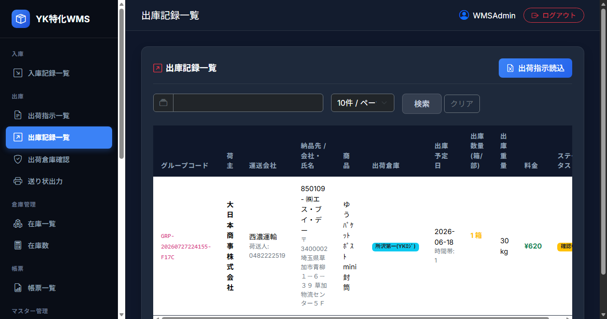
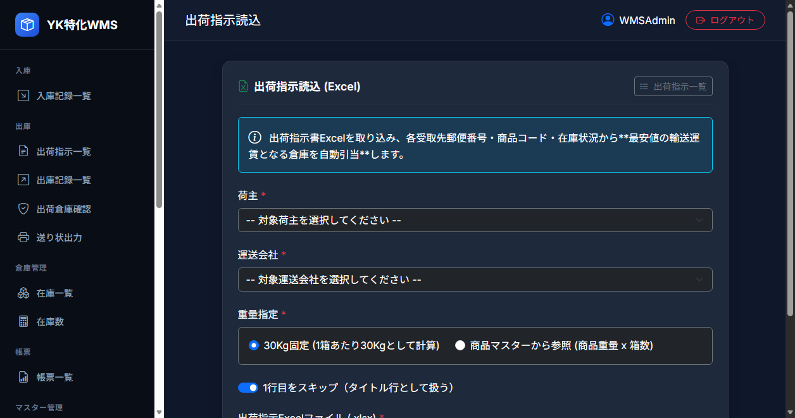
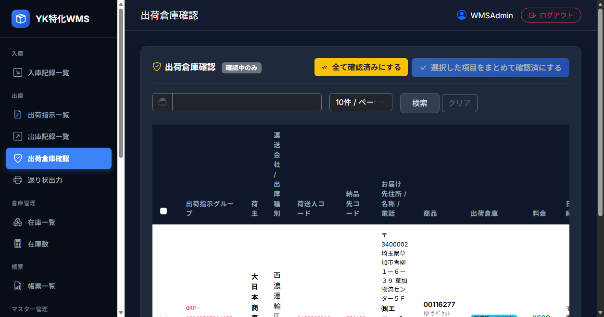
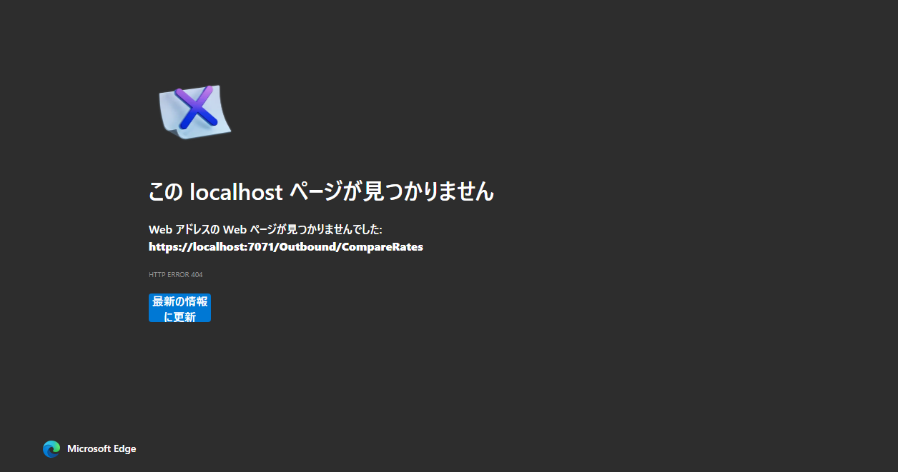
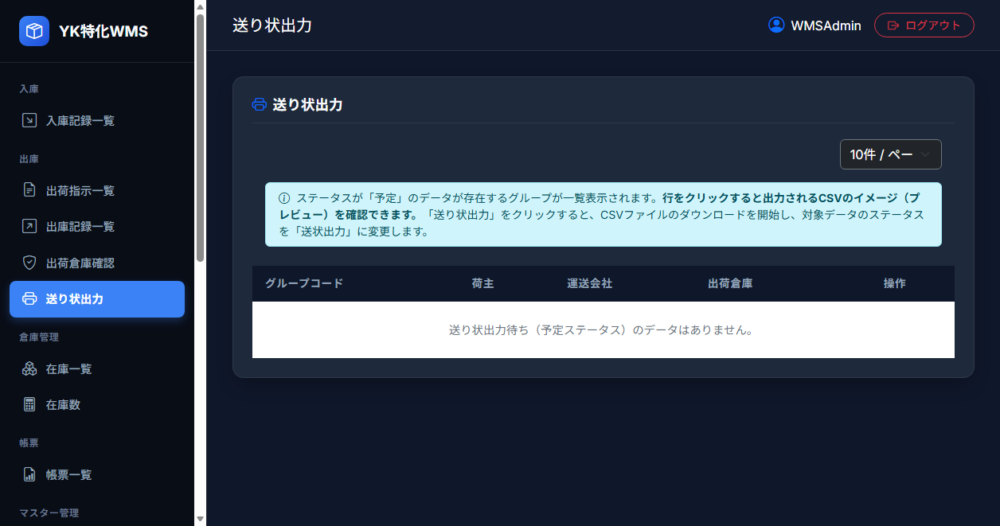

# 機能設計書 - 出庫

出荷指示書（Excel）を読み込み、出荷倉庫の自動選定と在庫引当（バラ出荷対応）、出荷倉庫の確認・調整、および送り状データのCSV出力を行う一連の出庫管理システム。

## 1. メニュー構成

出庫管理機能のメニューおよび画面遷移は以下の通り。

```
出庫
├─ 出庫記録一覧（/Outbound/List）
│   └─ [ボタン] 出荷指示読込（/Outbound/ImportInstruction）
├─ 出荷倉庫確認（/Outbound/ConfirmWarehouse）
│   ├─ [ボタン] 編集（/Outbound/Edit）
│   └─ [リンク] 運賃比較（/Outbound/CompareRates） ※ステータスバッジから遷移
└─ 送り状出力（/Outbound/ShippingLabel）
```

---

## 2. 出庫記録一覧

### 2.1 機能概要
登録されているすべての出庫データのリストを表示し、進捗状況（ステータス）を確認する。

### 2.2 画面キャプチャ


### 2.3 画面構成および操作ガイド
* **検索・ナビゲーション**: 出荷指示グループコードによるフィルタリング、「出荷指示読込」画面への遷移ボタン。
* **ステータスバッジリンク**: 「確認中」「該当料金無し」等のステータスバッジをクリックすることで「運賃比較」画面や「出荷倉庫確認」画面へ即座に移動可能。

| コントロール | 説明 |
| :--- | :--- |
| **出荷指示グループコード検索** | グループコード（部分一致）による絞り込み入力フォーム。 |
| **表示件数選択（ページサイズ）** | 1ページあたりの表示件数を 10, 20, 50, 100 件から選択（選択値はクッキーに保存）。 |
| **出荷指示読込ボタン** | 押下すると「出荷指示読込」画面へ遷移する。 |
| **出庫記録リスト** | 保存されている出庫データの一覧。ステータスに応じて「確認中」「該当料金無し」バッジから運賃比較画面へ遷移可能。 |

### 2.4 リスト表示項目
出庫記録一覧に表示される項目は以下の通り。

| カラム名 | 表示内容 | 紐づくデータ項目 |
| :--- | :--- | :--- |
| **グループコード** | 出荷指示ファイル読み込み時に自動発番された一意のグループコード | 出荷指示グループ（`t_outbound.shipping_instruction_group`） |
| **荷主** | 荷主名 | 荷主名（`m_shipper.shipper_name`） |
| **運送会社 / 出庫種別** | 運送会社名 および 出庫区分名 | 運送会社名（`m_carrier.carrier_name`） / 出庫区分名（`m_shipping_class.class_name`） |
| **荷送人コード** | 集荷エリアから引き当てられた荷送人コード | 荷送人コード（`t_outbound.sender_code`） |
| **納品先 / 会社・氏名** | お届け先コード、会社名1、氏名、郵便番号、住所1、住所2 | お届け先コード（`t_outbound.recipient_code`） / お届け先名称１（`t_outbound.company_name1`） / お届け先氏名（`t_outbound.recipient_name`） / お届け先郵便番号（`t_outbound.zip_code`） / お届け先住所１（`t_outbound.address1`） / お届け先住所２（`t_outbound.address2`） |
| **商品** | 商品名（マスタにない場合は商品コード） | 商品名（`m_product.product_name`） または 商品ID（`t_outbound.product_id`） |
| **出荷倉庫** | 引き当てられた出荷倉庫名 | 倉庫名（`m_warehouse.warehouse_name`） |
| **出庫予定日** | 出庫予定日 および 配達指定時間帯区分 | 出庫予定日（`t_outbound.scheduled_outbound_date`） / 配達指定区分（`t_outbound.delivery_time_class`） |
| **ケース数 (指示部数)** | 出荷箱数（単位：箱）および出荷総部数（単位：部） | ケース数（`t_outbound.case_count`） / 出荷指示部数（`t_outbound.total_pieces`） |
| **出庫重量** | 出荷総重量（単位：kg） | 出庫重量（`t_outbound.outbound_weight`） |
| **料金** | 採用された運賃料金（日本円表記） | 料金（`t_outbound.price`） |
| **ステータス** | 現在のステータスバッジ（「確認中」「予定」「送状出力」「請求済」「該当料金無し」「在庫切れ」） | ステータス（`t_outbound.status`） |

---

## 3. 出荷指示読込

### 3.1 機能概要
出荷指示が記載されたExcelファイルをアップロードし、出荷倉庫の選定、料金計算、およびバラ出荷に対応した在庫の自動引当（FIFO × バラ優先）を行って出庫データを作成する。

### 3.2 画面キャプチャ


### 3.3 画面項目および入力説明

| 項目名 | コントロール | 説明 |
| :--- | :--- | :--- |
| **荷主** | コンボボックス | 荷主マスタに登録されている荷主を選択する。初期値は空白（必須）。 |
| **運送会社** | コンボボックス | 運送会社マスタに登録されている運送会社を選択する。初期値は空白（必須）。 |
| **重量指定** | ラジオボタン | 重量計算方法を「30Kg固定」または「商品マスターから参照」から選択する。初期値は「30Kg固定」。 |
| **1行目をスキップ** | チェックボックス | Excelの1行目をタイトル行としてスキップするかどうかを指定する。初期値はON。 |
| **出荷指示ファイル** | ファイル選択 | 出荷指示のExcelファイル（.xlsx）を指定する（必須）。 |
| **読込み** | ボタン | アップロードおよび自動解析・データ作成処理を実行する。 |

### 3.4 操作手順
1. 画面上で「荷主」「運送会社」「重量指定」「1行目をスキップ」を選択する。
2. 「出荷指示ファイル」から対象のExcelファイルを選択する。
3. 「読込み」ボタンを押下する。エラーなく処理が完了した場合、自動生成された出荷指示グループコードで絞り込まれた状態で「出庫記録一覧」画面へ遷移する。

### 3.5 出荷指示読込および引当処理フロー（バックエンドロジック）

```mermaid
flowchart TD
    A[Excel読込: 出荷指示部数 TotalPieces の取得] --> B[在庫数チェック: 候補倉庫の保管中総部数が TotalPieces 以上か]
    B -->|在庫不足| C[倉庫未定 / ステータス 999 在庫切れ]
    B -->|在庫あり| D[最安倉庫の自動選定: 個配/路線運賃計算]
    D --> E{運賃計算成功か?}
    E -->|失敗| F[倉庫確定 / ステータス 801 該当料金無し]
    E -->|成功| G[在庫引当処理 AllocateInventoryAsync]
    
    subgraph 引当ロジック (FIFO × バラ優先)
        G --> H{バラ部数 > 0 ?}
        H -->|Yes| I[既存のバラ箱 is_loose=true を入庫日昇順で引当]
        I --> J{バラ部数は補いきれたか?}
        J -->|No| K[最古の未開封箱 is_loose=false を開封<br/>is_loose=true にして残数を引当]
        J -->|Yes| L[フルケースの引当]
        K --> L
        H -->|No| L
        L --> M[未開封箱を入力入数単位で引当<br/>inventory.status = 11]
    end

    M --> N[出荷箱数 case_count の算定<br/>フルケース数 + バラ部数有?1:0]
    N --> O[出庫重量および料金の確定・保存<br/>t_outbound / t_outbound_allocation]
```

#### ① 個数（ケース数）および重量の計算
* **出荷指示部数 (`total_pieces`)**: Excelの「品名部数」を取得。
* **ケース数（出荷箱数: `case_count`）の算出**:  
  $$\text{case\_count} = \lfloor \frac{\text{total\_pieces}}{\text{Product.Quantity}} \rfloor + (\text{total\_pieces} \pmod{\text{Product.Quantity}} > 0 ? 1 : 0)$$
  ※複数個のバラ箱から部数を取り出した場合でも、出荷時の梱包としては1つのバラ箱にまとめて出荷されるため、バラ部数が存在する場合は **+1箱** とします。
* **出庫重量の算出**:  
  * `30Kg固定` の場合: `30kg × ケース数(case_count)`
  * `商品マスターから参照` の場合: `商品マスタの登録重量（kg） × 出荷指示部数(total_pieces)`

#### ② 自動倉庫選定および料金計算ロジック
対象荷主・商品の有効在庫（保管中ステータス `status = 1` の `t_inventory.current_quantity` の総和）が出荷指示部数 `total_pieces` 以上存在し、選択した運送会社が利用可能な倉庫の中から、**最も運賃が安くなる倉庫**を自動選定する。

#### ③ 在庫データの引当処理（FIFO × バラ優先）
選定された「出荷倉庫」において、以下の優先順位で在庫の引当を行い、中間テーブル `t_outbound_allocation` に明細を作成する。
1. **バラ部数の引き当て**: 既存のバラ箱（`is_loose = true` かつ `current_quantity > 0`）を入庫実績日の古い順に引き当て、残数 `current_quantity` を減算。
2. **新規バラ箱の開封**: 既存バラ箱で不足する場合、未開封箱（`is_loose = false`）の最も古い1箱を開封して `is_loose = true` に更新し、必要なバラ部数を引き当て（残量はそのままバラ箱に保持）。
3. **フルケースの引き当て**: フルケース部数分について、未開封箱（`is_loose = false`）を古い順に引き当て、その箱のステータス（`status`）を `11`（予定 / 引当）に更新。

---

### 3.6 出荷指示書EXCELフォーマット

| 列 | カラム名（論理名） | 型 | 備考 |
| :--- | :--- | :--- | :--- |
| A | 納品先コード | 文字列 | お届け先コード（`t_outbound.recipient_code`） |
| B | 郵便番号 | 文字列 | ハイフンは自動で除去され、先頭7桁が格納される |
| C | 住所1 | 文字列 | お届け先住所１（`address1`） |
| D | 住所2 | 文字列 | お届け先住所２（`address2`） |
| E | 住所3 | 文字列 | お届け先住所３（`address3`） |
| F | 会社名1 (荷受人1) | 文字列 | お届け先名称１（`company_name1`） |
| G | 会社名2 (荷受人2) | 文字列 | お届け先名称２（`company_name2`） |
| H | 氏名 (納品先名) | 文字列 | お届け先氏名（`recipient_name`） |
| I | 電話番号 | 文字列 | お届け先電話番号（`tel`） |
| J | 商品コード | 文字列 | 商品ID（`product_id`、マスタ必須） |
| K | 品名 | 文字列 | |
| L | 入数 | 数値 | 箱詰めの際の1箱あたりの数量 |
| M | 品名部数 | 数値 | 出荷総部数（`t_outbound.total_pieces` として取り込み） |
| N | 記事 | 文字列 | 記事・備考（`notes`） |
| O | 出荷予定日 | 文字列 | 出庫予定日（`scheduled_outbound_date`） |
| P | 配達予定日 | 文字列 | |
| Q | 配達時間帯 | 数値 | 配達指定区分（`delivery_time_class`） |

---

## 4. 出荷倉庫確認および手動再選定 (ConfirmWarehouse / CompareRates)

### 4.1 機能概要
出荷指示読込の完了後、確認状態（ステータス `1` または `801`）の出庫データに対し、自動選定された倉庫や運賃の確認を行い、手動で倉庫を切り替える（再引当）ことができる。

### 4.2 出荷倉庫確認 画面キャプチャ


### 4.3 運賃比較 画面キャプチャ


### 4.4 画面説明および手動再選定操作
* **出荷倉庫確認画面**: 出荷対象商品、届先住所、および自動計算された最適倉庫・運賃を確認する。
* **運賃比較画面**: 選択可能な全候補倉庫における適用運賃金額を比較照会し、手動で変更先倉庫を選択する。
* **倉庫再選定時の引当解除・再引当フロー**:  
  手動で倉庫を変更した場合：
  1. **以前の引当解除**: `t_outbound_allocation` の引当データを解除（削除扱い）し、バラ引き当て分は旧倉庫のバラ箱残数（`current_quantity`）へ還元、フルケース引き当て分はステータスを `1`（保管中）へ戻す。
  2. **新倉庫への再引当**: 新倉庫の在庫（部数総和 $\ge$ `total_pieces`）から FIFO × バラ優先ルールで再引当を行い、新ケース数 (`case_count`) および運賃を再計算・保存する。

---

## 5. 送り状出力

### 5.1 機能概要
出荷準備が整ったデータの送り状CSVファイルを出力し、同時に出庫確定（売上確定）を行う。

### 5.2 画面キャプチャ


### 5.3 画面構成および出力処理仕様
* **出力対象選択**: 荷主・運送会社・出庫予定日を選択し、対象データを一覧表示・チェック選択する。
* **CSV出力および出庫確定**:  
  「CSV出力」ボタンを押下して送り状データをダウンロードしたタイミングで、以下の更新処理を実行する：
  * **出庫データ（`t_outbound`）**: ステータスを **`21: 送状出力`** に更新。
  * **引当中間データ（`t_outbound_allocation`）**: ステータスを **`21: 出庫済`** に更新。
  * **在庫データ（`t_inventory`）**: 
    * フルケース箱: ステータスを **`21: 出庫`** に更新。
    * バラ箱: 出庫により部数を使い切った場合（`current_quantity == 0`）、ステータスを **`21: 出庫 (空箱化)`** に更新。部数が残っている場合はステータス `1: 保管中` のまま維持。

---

## 6. 関連するトランザクションテーブル

### 6.1 出庫テーブル
* **物理テーブル名**: `t_outbound`
* **主キー**: `outbound_id`

| 論理名 | 物理名 | 主キー | 必須 | 型 | サイズ | 備考 |
| :--- | :--- | :---: | :---: | :--- | :---: | :--- |
| **出庫ID** | `outbound_id` | 〇 | 〇 | uniqueidentifier | - | 自動発番（Guid） |
| **荷主ID** | `shipper_id` | | 〇 | uniqueidentifier | - | 荷主マスタ ID |
| **倉庫ID** | `warehouse_id` | | | uniqueidentifier | - | 出荷倉庫マスタ ID |
| **商品ID** | `product_id` | | 〇 | varchar | 8 | 商品コード |
| **運送会社ID** | `carrier_id` | | 〇 | uniqueidentifier | - | 運送会社マスタ ID |
| **出荷指示グループ** | `shipping_instruction_group` | | 〇 | varchar | 64 | グループコード |
| **出荷指示部数** | `total_pieces` | | 〇 | int | - | **新規追加：出荷要求総部数** |
| **ケース数** | `case_count` | | 〇 | int | - | **出荷箱数 (フル箱数 ＋ バラ箱数)** |
| **出庫重量** | `outbound_weight` | | | int | - | 出荷総重量 |
| **料金** | `price` | | | decimal | 18, 2 | 採用された運賃 |
| **ステータス** | `status` | | 〇 | int | - | `1`:確認中, `11`:予定, `21`:送状出力, `801`:該当料金無し, `999`:在庫切れ |

### 6.2 出庫引当中間テーブル（新規追加）
* **物理テーブル名**: `t_outbound_allocation`
* **主キー**: `allocation_id`

| 論理名 | 物理名 | 主キー | 必須 | 型 | サイズ | 備考 |
| :--- | :--- | :---: | :---: | :--- | :---: | :--- |
| **引当ID** | `allocation_id` | 〇 | 〇 | uniqueidentifier | - | 自動発番 (PK) |
| **出庫ID** | `outbound_id` | | 〇 | uniqueidentifier | - | 外部キー (`t_outbound`) |
| **在庫ID** | `inventory_id` | | 〇 | uniqueidentifier | - | 外部キー (`t_inventory`) |
| **引当部数** | `allocated_quantity` | | 〇 | int | - | この箱から引き当てた部数 |
| **バラ出荷フラグ** | `is_loose_shipment` | | 〇 | bit | - | `true`: バラ引当, `false`: ケース引当 |
| **ステータス** | `status` | | 〇 | int | - | `11`: 引当済, `21`: 出庫済 |
