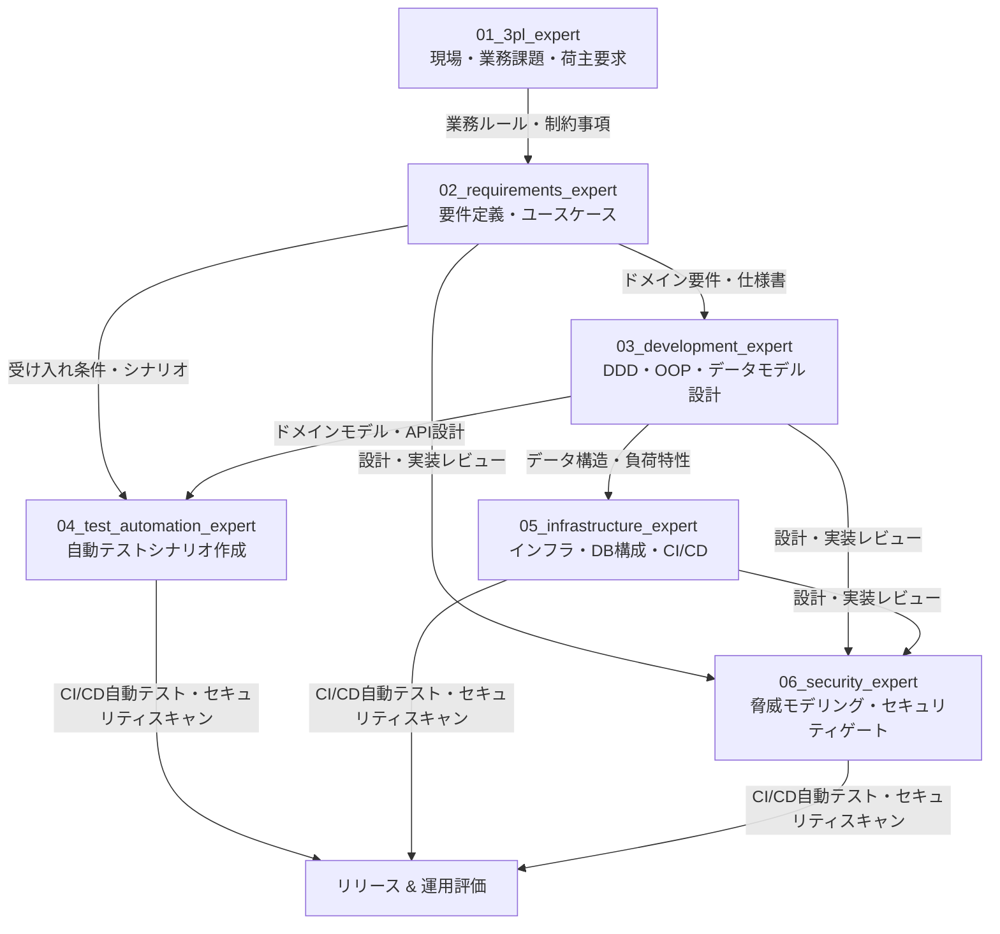

# WMS開発チーム 全体ガイド & メンバー連動開発プロセス

本ディレクトリは、Project RouteX（倉庫管理システム）開発プロジェクトにおいて、各分野の専門家が強みを活かし、互いに連動しながら高品質なシステムを迅速に構築・運用するための仕様およびガイドラインを管理します。

---

## 1. 開発チーム構成（専門家一覧）

| フォルダ名 | 専門家名 | 主な役割・責務 |
| :--- | :--- | :--- |
| [`01_3pl_expert/`](file:///c:/011_%E9%96%8B%E7%99%BA/YK%E7%89%B9%E5%8C%96WMS%E9%96%8B%E7%99%BA/team/01_3pl_expert/README.md) | **3PL業界の専門家** | マルチ荷主運用、波動対応、荷姿・保管効率、作業単価/請求、現場オペレーション最適化 |
| [`02_requirements_expert/`](file:///c:/011_%E9%96%8B%E7%99%BA/YK%E7%89%B9%E5%8C%96WMS%E9%96%8B%E7%99%BA/team/02_requirements_expert/README.md) | **要件定義の専門家** | 業務フロー可視化、ユースケース定義、機能/非機能要件定義、トレーサビリティ管理 |
| [`03_development_expert/`](file:///c:/011_%E9%96%8B%E7%99%BA/YK%E7%89%B9%E5%8C%96WMS%E9%96%8B%E7%99%BA/team/03_development_expert/README.md) | **開発の専門家** | オブジェクト指向設計(OOP)、ドメイン駆動設計(DDD)、データモデル設計、C#/.NET MVC実装 |
| [`04_test_automation_expert/`](file:///c:/011_%E9%96%8B%E7%99%BA/YK%E7%89%B9%E5%8C%96WMS%E9%96%8B%E7%99%BA/team/04_test_automation_expert/README.md) | **テスト自動化の専門家** | 単体/結合/E2Eテスト自動化戦略、BDD/TDD推進、CI/CDテストパイプライン組込 |
| [`05_infrastructure_expert/`](file:///c:/011_%E9%96%8B%E7%99%BA/YK%E7%89%B9%E5%8C%96WMS%E9%96%8B%E7%99%BA/team/05_infrastructure_expert/README.md) | **インフラ設計の専門家** | クラウド/オンプレ環境設計、高可用性・拡張性確保、DBチューニング、モニタリング・ログ基盤 |
| [`06_security_expert/`](file:///c:/011_%E9%96%8B%E7%99%BA/YK%E7%89%B9%E5%8C%96WMS%E9%96%8B%E7%99%BA/team/06_security_expert/README.md) | **セキュリティ管理の専門家** | 認可・認証(RBAC)、データ保護・暗号化、監査ログ、DevSecOpsセキュリティゲート |

---

## 2. メンバー間連動開発（コラボレーション）フロー

単なる個別の役割分担にとどまらず、各フェーズでインプット・アウトプットを密接に受け渡すことで、手戻りのない連動開発を実現します。

### 連携マトリクス（誰が誰に何を受け渡すか）

1. **3PL専門家 ➡ 要件定義専門家**
   - **Input**: 荷主ごとの入荷・出荷・保管ルール、波動特性、請求計算ロジック、ハンディ端末現場操作フロー
   - **Output (要件定義へ)**: 要件定義のインプットとなる「業務ルール仕様」および「業務例外ケース」

2. **要件定義専門家 ➡ 開発専門家 / テスト自動化専門家**
   - **Input**: 業務ルール仕様
   - **Output (開発へ)**: ドメイン概念、ユースケース図、画面遷移図、非機能要件
   - **Output (テスト自動化へ)**: Gherkin形式等の受け入れ条件 (Given-When-Then)

3. **開発専門家 ➡ インフラ専門家 / テスト自動化専門家 / セキュリティ専門家**
   - **Input**: ドメイン要件、セキュリティ設計指針
   - **Output (インフラへ)**: ER図、DB読み書き負荷予測、外部I/F（ハンディ・プリンタ・EDI）仕様
   - **Output (テスト自動化へ)**: 単体テスト可能なコンポーネント構造、APIインターフェース定義
   - **Output (セキュリティへ)**: 認証・認可コンポーネント、データアクセスレイヤーの実装案

4. **テスト自動化専門家 ➡ 開発専門家 / インフラ専門家**
   - **Input**: 受け入れシナリオ、開発コード
   - **Output (開発へ)**: テスト結果フィードバック、バグ報告、カバレッジレポート
   - **Output (インフラへ)**: CI/CDパイプライン上で実行する自動テストスクリプト

5. **インフラ専門家 ➡ 開発専門家 / セキュリティ専門家**
   - **Input**: データモデル、負荷予測、セキュリティ要件
   - **Output (開発へ)**: CI/CDパイプライン、開発・検証環境、パフォーマンス測定結果
   - **Output (セキュリティへ)**: ネットワーク構成、暗号化設定、アクセスログ収集基盤

6. **セキュリティ管理専門家 ➡ 全メンバー**
   - **Input**: システム構成図、データフロー図、ソースコード
   - **Output (全般へ)**: セキュリティポリシー、認可ルール（RBACマトリクス）、DevSecOpsチェックリスト、脆弱性判定レポート

---

## 3. 連動開発の運用ルール

1. **仕様変更の連動ルール**
   - 業務要件や仕様に変更が生じた場合、要件定義専門家が更新し、即座に開発専門家（モデル修正）およびテスト自動化専門家（テストコード修正）に同期します。
2. **継続的フィードバック**
   - CI/CDパイプラインにおいてテスト自動化専門家のスクリプトとセキュリティ専門家の静的解析を連動実行し、開発専門家へ即時フィードバックを行います。
3. **現場適合性の検証**
   - リリース前に3PL業界専門家が現場オペレーション（ハンディ操作性、スキャン速度、棚卸効率等）の最終確認を行います。
